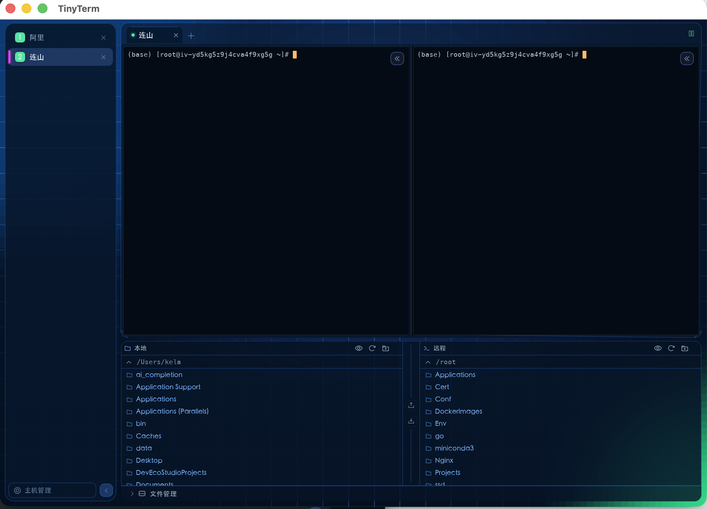

# TinyTerm (egui)

TinyTerm 的 **egui / eframe** 重写版本 —— 一个纯 Rust 的桌面 SSH 客户端，视觉与交互对齐原版
Tauri + React 实现（cosmic / glassmorphism 主题）。



```
tinyterm-egui/
├── Cargo.toml
├── README.md
├── docs/
│   ├── ANALYSIS.md             # 原版全量功能与 UI 细节分析（需求基线）
│   ├── spec-backend.md         # Rust 后端逐命令规格（SQL/SSH/SFTP/加密）
│   └── spec-filemanager.md     # 文件管理器逐交互规格
└── src/
    ├── main.rs                 # 入口：存储、tokio runtime、eframe
    ├── app.rs                  # eframe::App：布局、事件泵、弹窗路由
    ├── state.rs                # 应用状态（Host/Session 标签、文件管理器、弹窗、Toast）
    ├── actions.rs              # 状态迁移（等价于原版 Zustand store actions）
    ├── models.rs               # 数据模型
    ├── storage.rs              # SQLite（与原版同 schema）
    ├── crypto.rs               # ttenc:v1 密钥信封（RSA-OAEP + AES-256-GCM）
    ├── ssh.rs                  # russh：连接、指纹校验、认证、PTY、exec、SFTP
    ├── session.rs              # 会话管理 + 事件总线
    ├── remote_fs.rs            # SFTP 远端文件操作 + tar 目录传输
    ├── local_fs.rs             # 本地文件操作与删除保护
    ├── transfer.rs             # 上传/下载编排（批次、tar、降级、冲突）
    ├── term.rs                 # vt100 终端仿真 + egui 网格渲染 + 按键编码
    ├── theme.rs                # 设计令牌（颜色/圆角/字号/光晕/星空背景）
    ├── widgets.rs              # 自绘控件（按钮、输入框、图标、加载动画）
    └── ui/                     # 各界面模块
        ├── sidebar.rs          # 左侧主机侧边栏
        ├── session_tabs.rs     # 顶部会话标签条
        ├── terminal_view.rs    # 终端面板（输入/选择/滚动/右键/状态覆盖层）
        ├── file_manager.rs     # 文件管理双栏 + 传输队列 + 右键菜单
        ├── quick_actions.rs    # 快捷操作栏 + 常用指令 + 历史命令
        ├── system_info.rs      # CPU / 内存 / 磁盘表格弹窗
        ├── hosts_modal.rs      # 主机管理弹窗 + 主机表单
        ├── credentials_modal.rs# 凭据管理弹窗 + 凭据表单
        ├── settings_modal.rs   # 设置面板（原版缺失，此处补齐）
        ├── dialogs.rs          # 确认/冲突/登录/粘贴确认
        └── toast.rs            # 右下角通知
```

## 构建与运行

> 改造本项目前先读 `skills/tinyterm-egui-dev/SKILL.md`：里面沉淀了设计令牌、布局常量、
> SSH/SFTP 事件契约、打包流水线，以及一路踩过的坑（`-1728`、`crt-static`、wgpu 等）。

需要 Rust 1.85+（开发使用 nightly 1.100）。

```bash
cargo run --release
```

首次构建会编译 eframe/wgpu 等依赖，耗时较长。若网络受限：

```bash
CARGO_NET_OFFLINE=true cargo build
```

## 测试

```bash
cargo test
```

13 个测试覆盖：加密信封往返、SQLite CRUD 与设置迁移、终端仿真与按键编码、
路径/进度/解析辅助函数、本地 tar 打包解包、删除保护，以及一个**进程内 russh
测试服务器驱动的 SSH 端到端测试**（首次连接指纹提示 → 信任后握手 → 错误密码被拒 →
密码认证成功 → exec / 远端 HOME / 远端 cwd → PTY shell 回显 → SFTP 子系统协商）。

## 数据位置

| 文件 | 路径 |
|---|---|
| SQLite | `~/Library/Application Support/com.tinyterm.app/tinyterm.db` |
| 密钥 | 同目录 `secret-key.pem` |
| 缩放 | 同目录 `zoom.txt` |

环境变量 `TINYTERM_DB` 可覆盖数据库路径（指向原版 `tinyterm.db` 即可直接复用历史主机与凭据）。
若平台数据目录不可写，会自动回退到 `~/.tinyterm-egui/tinyterm.db`。

数据库 schema 与原版 TinyTerm **完全一致**，且加密信封格式相同，因此可以直接复用已有的
`tinyterm.db`（凭据会自动解密）。

## 已实现功能

- 主机 / 凭据 CRUD、搜索、复制、连接
- 多主机标签 + 多会话标签，标签切换保留终端上下文
- SSH 连接、主机指纹信任流程（首次 / 变更）、密码与私钥认证
- 完整终端仿真：256 色、粗体/斜体/下划线/反显、光标样式与闪烁、scrollback、文本选择与复制粘贴
- 右侧辅助终端（独立 SSH 会话并排）
- 文件管理器：本地/远程双栏、隐藏文件、路径编辑、重命名、新建文件夹、删除保护
- 上传 / 下载：单文件、目录（tar 打包）、批次队列、进度、取消、冲突处理
- 终端 cwd 跟随远端目录
- 快捷操作栏：CPU / 内存 / 磁盘查询、常用指令库、shell 历史
- 设置面板：字体、scrollback、光标、隐藏文件、界面缩放、已信任指纹管理
- 主机可达性探测与自动重连
- Toast 通知、统一确认对话框、登录提示、粘贴确认
- 终端鼠标上报（SGR/X10，TUI 程序可用）、括号粘贴（bracketed paste）

## 图标与品牌资源

界面图标使用 [Phosphor Icons](https://phosphoricons.com)（MIT），字体文件内嵌在
`assets/Phosphor.ttf`，常量在 `src/icons.rs`。之所以不直接依赖 `egui-phosphor`：
该 crate 目前绑的是 egui 0.35，会把整个 egui 0.35/epaint 0.35 依赖树再编译一遍；
直接内嵌 TTF 只增加约 490 KB 二进制体积。

原版 TinyTerm 的品牌资源也一并复用：

| 文件 | 来源 | 用途 |
|---|---|---|
| `assets/icon.png` | `src-tauri/icons/icon.png`（512×512） | 窗口图标（`ViewportBuilder::with_icon`） |
| `assets/logo.png` | `public/assets/logo.png`（512×512） | 空状态 / 空会话里的 logo 贴图 |
| `assets/icon.icns` | `src-tauri/icons/icon.icns` | macOS `.app` 包图标 |
| `assets/icon.ico` | 由 `icon.png` 生成（16–256 全尺寸） | Windows exe 图标 + NSIS 安装包图标 |
| `assets/screenshot.png` | 本机运行截图 | README 界面预览 |

macOS 说明：winit 在 macOS 上**不支持** `set_window_icon`，Dock/Finder 图标只能来自
`.app` 包里的 `.icns`，所以图标必须靠打包脚本写进 bundle（见下节）。

## 打包与分发

GitHub Actions 在推送 `v*` tag 时构建两个产物，并**同时发布到 GitHub Release**，
从 `Releases` 页面直接下载（Actions 的 Artifacts 里也各留一份）：

| 平台 | 产物 | 说明 |
|---|---|---|
| macOS 通用版 | `TinyTerm-macos-universal.dmg` | arm64 + x86_64 用 `lipo` 合并，带背景图的拖拽安装盘 |
| Windows x86_64 | `TinyTerm-windows-x86_64-setup.exe` | NSIS 安装包，按用户安装，不需要管理员权限 |

### macOS

```bash
./scripts/bundle-macos.sh      # 生成 target/release/TinyTerm.app 和 TinyTerm.dmg
open target/release/TinyTerm.app
```

`scripts/make-dmg.sh` 生成带背景图的拖拽安装盘：左侧是 TinyTerm，右侧是
`/Applications` 别名，背景图底部给出两种 Gatekeeper 拦截的解决办法。

| 文件 | 用途 |
|---|---|
| `assets/dmg-background.png` / `@2x.png` | 660×440 / 1320×880 背景图 |
| `scripts/make-dmg-background.swift` | 背景图生成器（改文案后重新运行即可） |
| `scripts/make-dmg.sh` | 组装 `.app` → UDRW 镜像 → Finder 布局 → UDZO |

```bash
swift scripts/make-dmg-background.swift          # 重新生成背景图
scripts/make-dmg.sh dist/TinyTerm.app out.dmg    # 打包
```

布局靠 AppleScript 驱动 Finder 写入 `.DS_Store`；若当前环境不允许自动化控制
Finder，脚本会照常产出 DMG，只是没有背景图和图标位置（会打印 warning）。

因为构建产物未做 Apple 签名与公证，用户首次打开会遇到两种情况，背景图里都写了：

1. **「TinyTerm 已损坏，无法打开」** —— 从浏览器下载的文件带 quarantine 属性，
   打开「终端」执行 `xattr -cr /Applications/TinyTerm.app` 即可。
2. **「无法验证开发者」** —— 点「完成」关闭弹窗，再到
   系统设置 → 隐私与安全性，找到 TinyTerm 点「仍要打开」。

### Windows

| 文件 | 用途 |
|---|---|
| `scripts/windows-installer.nsi` | NSIS 脚本：安装到 `%LOCALAPPDATA%\Programs\TinyTerm`，创建开始菜单/桌面快捷方式，写入「应用和功能」卸载项 |
| `.cargo/config.toml` | 为 Windows 目标打开 `+crt-static`（见下） |
| `build.rs` | 用 `winresource` 把 `assets/icon.ico` 和版本信息嵌进 exe（非 Windows 平台跳过） |
| `assets/icon.ico` | 由 `scripts/make-windows-icon.swift` 从 `assets/icon.png` 生成 |

```powershell
cargo build --release
makensis /DAPP_VERSION=0.1.2 `
  /DAPP_EXE="$PWD\target\release\tinyterm-egui.exe" `
  /DOUT_FILE="$PWD\TinyTerm-0.1.2-setup.exe" `
  /DICON_FILE="$PWD\assets\icon.ico" `
  scripts\windows-installer.nsi
```

**关于 `VCRUNTIME140.dll was not found`**：MSVC 目标默认动态链接 VC 运行库，没装
VC++ Redistributable 的机器上直接跑 exe 就会报这个错。`.cargo/config.toml` 给
`x86_64-pc-windows-msvc` 加了 `-C target-feature=+crt-static`，把运行库静态链进
exe，安装包因此不依赖任何额外组件。`main.rs` 里的
`#![cfg_attr(all(target_os = "windows", not(debug_assertions)), windows_subsystem = "windows")]`
则保证 release 版不弹控制台窗口。

**关于远程桌面/虚拟机里打不开**：Windows 版默认用 **wgpu** 渲染（DX12），并且自定义
了适配器选择——优先独显/集显，没有可用 GPU 时退到软件光栅化（WARP），所以远程桌面
会话和无 GPU 的云主机也能正常启动；macOS/Linux 仍然用 glow/OpenGL。
启动日志写在 `%USERPROFILE%\.tinyterm-egui\tinyterm.log`，致命错误会弹原生对话框。

## 与原版的差异（有意为之）

1. 终端仿真使用 `vt100` 而非 xterm.js；已覆盖常用 VT100/xterm 序列。
2. 使用 `russh`（纯 Rust）替代 libssh2，SFTP 与终端共用一条 SSH 连接（原版为独立连接）。
3. 增加连接超时（30s），避免黑洞主机无限等待。
4. 补齐原版缺失的完整设置面板。
5. 侧边栏折叠、缩放等交互改用 egui 原生实现（`Cmd/Ctrl + +/-/0` 仍然可用）。
