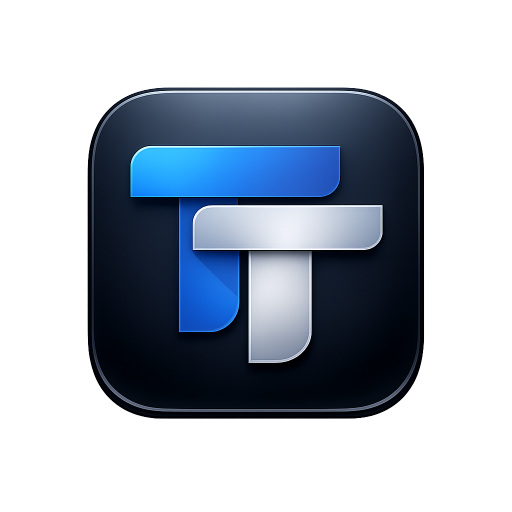
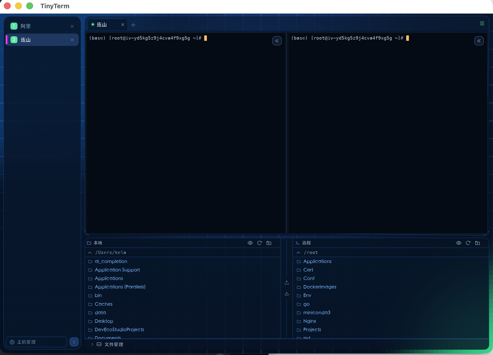

<div align="center">



# TinyTerm

**A native SSH &amp; SFTP client for macOS and Windows — written in Rust with
[egui](https://github.com/emilk/egui). One binary, no browser engine, no runtime to install.**

[](https://github.com/miaokela/tinyterm-egui/actions/workflows/build.yml)
[](https://github.com/miaokela/tinyterm-egui/releases)


[**English**](README.md)&nbsp;&nbsp;|&nbsp;&nbsp;[简体中文](README.zh-CN.md)



</div>

TinyTerm is a desktop SSH client that draws its entire interface with GPU
shapes: the shell, the panels and every button are hand-painted, so the
frosted-glass look, the gaps between panels and the z-order stay exactly under
control. Connections, the terminal emulator, transfers and storage all run in
the same process — there is no sidecar service and no WebView.

It is an egui/eframe reimplementation of the original Tauri + React TinyTerm,
and it deliberately keeps that app's **on-disk format**: same SQLite schema,
same encrypted-secret envelope, same data directory. Point it at an existing
`tinyterm.db` and your hosts, accounts and settings are simply there.

## Highlights

- **Real terminal** — VT100/ANSI emulation with 256 colours, bold/italic/underline/reverse, configurable scrollback, three cursor styles, mouse reporting for TUI apps and bracketed paste.
- **Tabs that keep their state** — one tab per host, any number of sessions per host; switching tabs never drops scrollback or selection.
- **Accounts, not just passwords** — reusable password/private-key accounts, encrypted at rest, linked to hosts or prompted per connection.
- **Built-in file manager** — dual-pane local/remote browsing, upload/download of files and whole directories, a transfer queue with progress and cancel, and conflict handling before anything is overwritten.
- **Everything follows the keyboard** — zoom, settings, copy/paste, multi-select, and a quick-action bar with CPU/memory/disk snapshots, a command cheatsheet and your shell history.
- **Honest security posture** — host-key verification with SHA-256 fingerprints (trusted on first use, loud on change), secrets never stored in plain text, no telemetry.

## Features

### Terminal

- VT100/ANSI emulation (`vt100`): 256 colours, the full 16-colour ANSI palette, bold / italic / underline / reverse video
- Configurable scrollback, three cursor styles (block / bar / underline) with optional blinking
- Text selection and copy/paste (`Cmd/Ctrl` + `C` / `V`), right-click menu, paste confirmation with a preview and the `N lines · M chars` size
- Mouse reporting for TUI programs (htop, vim, …); hold `Shift` while dragging to select text instead
- Bracketed paste (DECSET 2004), so pasting into shells and editors behaves like the real thing
- Side terminal: a second, independent SSH session next to the current one
- Quick-action bar: CPU / memory / disk snapshots, a five-category command cheatsheet and your shell history — double-click to insert, one click to run
- Connection overlay with a reconnecting state and, for authentication failures, an inline password field

### Hosts & accounts

- Host CRUD with colour tag, notes, remote and local starting directories, per-host port and keepalive
- Reusable accounts: password or private key (with passphrase); link one to a host, or let the login prompt ask at connect time
- Host manager with search, duplicate and delete (behind a confirmation)
- Host-key verification: `SHA256:` fingerprints with first-use trust, change detection and a trusted-key list in settings
- Reachability probing with automatic reconnect — unreachable hosts dim out and come back on their own

### File manager

- Dual-pane (local + remote) file browser, collapsed into the bottom bar of the window
- Upload / download for single files and whole directories, queued with progress, byte counters and cancel
- Directory transfers use `tar` on the server when available (one round trip) and fall back to per-file SFTP when it is not
- Conflict handling before a transfer starts: merge/overwrite decisions, per file or apply-to-all
- Rename, create folder, delete (with guards), copy path, per-panel hidden-file toggle, editable path bar
- The remote pane follows the working directory of the active terminal

### Interface

- Cosmic / glassmorphism theme: starfield and drifting grid background, frosted panels, neon accents, one shared corner-radius system
- Settings panel: terminal font and size, scrollback, cursor style and blinking, default hidden-file visibility, trusted fingerprints, UI zoom
- Toasts, unified confirmation dialogs, and a login prompt for hosts without an account
- UI zoom with `Cmd/Ctrl` + `+` / `-` / `0` (0.8× – 1.6×)

## Install

Grab the package for your platform from
[**Releases**](https://github.com/miaokela/tinyterm-egui/releases):

| Platform | Package | First launch |
|---|---|---|
| macOS 11+ (Apple silicon & Intel) | `TinyTerm-macos-universal.dmg` | Unsigned build: **right-click → Open** the first time |
| Windows 10/11 (x64) | `TinyTerm-windows-x86_64-setup.exe` | SmartScreen: **More info → Run anyway** |
| Linux, others | build from source | Needs X11 or Wayland |

The macOS package is a universal binary (arm64 + x86_64) built in CI, and every
release also ships SHA-256 checksums.

## Quick start

1. **Add a host** — click `＋` in the left sidebar and fill in the address and port. An account is optional: without one, TinyTerm asks for the password when you connect.
2. **Connect** — hit the round connect button on the host row. The first connection asks you to confirm the host's SSH fingerprint.
3. **Open more sessions** — `＋` in the tab strip adds a session to the same host; the button on the right of the tab strip opens a side terminal.
4. **Move files** — click the 文件管理 bar at the bottom, select files on either side, then use the `→` / `←` buttons in the middle (or right-click for the context menu).
5. **Make it yours** — `Cmd/Ctrl` + `,` opens settings: font, cursor, scrollback, hidden files, trusted keys.

> The interface is currently Simplified Chinese — see [Known limitations](#known-limitations).

## Keyboard shortcuts

| Shortcut | Action |
|---|---|
| `Cmd/Ctrl` + `+` / `-` | Zoom in / out (0.8× – 1.6×) |
| `Cmd/Ctrl` + `0` | Reset zoom to 100 % |
| `Cmd/Ctrl` + `,` | Open settings |
| `Cmd/Ctrl` + `C` / `V` | Copy the selection / paste into the terminal |
| `Cmd/Ctrl` + click | Toggle an item in the file-list selection |
| `Shift` + click | Select a range of files |
| `Shift` + drag in the terminal | Select text even while a TUI program owns the mouse |
| Double-click | Insert a cheatsheet command / run a history entry |
| `Enter` / `Esc` | Confirm / cancel the focused dialog |

## Data, security & privacy

Everything lives in one directory:

| Platform | Directory |
|---|---|
| macOS | `~/Library/Application Support/com.tinyterm.app/` |
| Windows | `%APPDATA%\com.tinyterm.app\` |
| Fallback (unwritable data dir) | `~/.tinyterm-egui/` |

| File | Contents |
|---|---|
| `tinyterm.db` | SQLite database: hosts, accounts, settings, trusted host keys |
| `secret-key.pem` | RSA-2048 private key used to encrypt account secrets (mode `0600` on Unix) |
| `zoom.txt` | Interface zoom, written only when it differs from the default |

Set the `TINYTERM_DB` environment variable to use a different database file.

**Secrets at rest.** Passwords and private keys are stored as
`ttenc:v1:<wrapped-key>:<nonce>:<tag>:<ciphertext>` envelopes: a per-record
AES-256-GCM key, itself wrapped with RSA-2048 OAEP/SHA-1 using this install's
`secret-key.pem`. Copying the database to another machine therefore does not
reveal any credential.

**Host identity.** Before authenticating, the SSH host key is checked against
the `SHA256:` fingerprints in `trusted_host_keys`. An unknown host asks for
confirmation; a *changed* host key is reported as a possible
man-in-the-middle attack and can be re-trusted from the settings list.

**Network.** TinyTerm only opens the SSH/SFTP connections you ask for. There is
no telemetry, no update ping and no cloud component.

## Build from source

Requires **Rust 1.85+** (stable) and the platform C toolchain. SQLite is
bundled (`rusqlite` with the `bundled` feature), so nothing else is needed.

```bash
git clone https://github.com/miaokela/tinyterm-egui.git
cd tinyterm-egui
cargo run --release
```

The first build compiles egui/eframe and russh from scratch and takes several
minutes. If the network is restricted:

```bash
CARGO_NET_OFFLINE=true cargo build
```

### Tests

```bash
cargo test
```

22 tests cover the encrypted-envelope round-trip, SQLite CRUD and settings
migration, terminal emulation and key encoding, path / progress / history
parsers, local `tar` packing and unpacking, deletion guards, headless UI
layout, and a full SSH end-to-end run driven by an in-process `russh` server
(unknown fingerprint → trust → handshake → rejected password → successful
authentication → `exec` / remote `$HOME` / remote `cwd` → PTY echo → SFTP
subsystem).

### Packaging

`scripts/bundle-macos.sh` + `scripts/make-dmg.sh` produce the macOS app bundle
and the styled `.dmg`; `scripts/windows-installer.nsi` builds the NSIS
installer. [`.github/workflows/build.yml`](.github/workflows/build.yml) runs
both on every `v*` tag, runs the test suite in release mode and publishes the
artifacts as a GitHub Release.

## Project layout

```
src/
├── main.rs            entry point: storage, tokio runtime, eframe
├── app.rs             eframe::App: layout, event pump, modal routing, shortcuts
├── state.rs           application state (tabs, file manager, modals, toasts)
├── actions.rs         state transitions (the store actions of the original app)
├── models.rs          data models (host, account, settings, transfers)
├── storage.rs         SQLite access, schema, data locations
├── crypto.rs          ttenc:v1 secret envelope (RSA-OAEP + AES-256-GCM)
├── ssh.rs             russh: connect, host-key check, auth, PTY, exec, SFTP
├── session.rs         session manager and the UI event bus
├── remote_fs.rs       SFTP operations and tar-based directory transfer
├── local_fs.rs        local filesystem access and delete guards
├── transfer.rs        upload/download orchestration (batches, conflicts)
├── term.rs            vt100 emulation, grid rendering, key encoding
├── theme.rs           design tokens (colour, radius, type, glow, starfield)
├── widgets.rs         hand-painted controls (buttons, inputs, glyphs)
└── ui/                one module per surface: sidebar, session tabs, terminal,
                       file manager, quick actions, system info, hosts, accounts,
                       settings, dialogs, toasts
```

Anyone touching the design system should read
[`skills/tinyterm-egui-dev/`](skills/tinyterm-egui-dev/SKILL.md) first: it holds
the token tables, the layout constants, the SSH/SFTP event contract and the
packaging pipeline. `docs/` contains the requirement baseline (`ANALYSIS.md`)
and the backend / file-manager specifications.

## Architecture

| Layer | Choice |
|---|---|
| Windowing & rendering | `eframe` + `egui` 0.36 — glow on macOS and Linux, wgpu (D3D12, with the software rasterizer as a fallback for VMs and remote sessions) on Windows |
| Async runtime | `tokio` (multi-threaded) for SSH, SFTP, transfers and file I/O |
| SSH / SFTP | `russh` 0.63 (ring + flate2 + rsa) and `russh-sftp` 3 |
| Terminal | `vt100` 0.16 for emulation, with a custom grid renderer on top |
| Storage | `rusqlite` with bundled SQLite |
| Secrets | `rsa`, `aes-gcm`, `sha1` for the `ttenc:v1` envelope |

Every region of the window is an explicit `Rect` painted by `src/theme.rs` and
`src/widgets.rs` — no `SidePanel`/`CentralPanel`, no retained widget tree.
Background work runs on the tokio runtime and reports back through an event bus
that `app.rs` drains once per frame.

## Compatibility with the original TinyTerm

- **Same database** — the egui build uses the original app's `app_data_dir` and schema, so it opens an existing `tinyterm.db` directly (`TINYTERM_DB` overrides the path).
- **Same secret format** — `ttenc:v1` envelopes are interchangeable; account secrets decrypt in either application.
- **Added here** — a full settings panel (the web version had none), account management, and a layout that no longer depends on a WebView.
- **Not carried over** — see the limitations below.

## Known limitations

- Packages are published for macOS and Windows only; on Linux, build from source.
- No port forwarding, jump hosts or SSH-agent forwarding.
- Tabs and sessions are not restored after a restart (hosts, accounts, settings and trusted keys are persistent).
- The file manager has no drag-and-drop between panes and no permission (`chmod`) editing.
- Interface strings are Simplified Chinese only; there is no language switch yet.
- The packages are unsigned, so macOS Gatekeeper and Windows SmartScreen warn on first launch.

## License & credits

Released under the **MIT license** (declared in `Cargo.toml`).

- Interface icons: [Phosphor Icons](https://phosphoricons.com) (MIT), vendored as `assets/Phosphor.ttf` and registered as a font fallback instead of pulling in a second egui dependency tree.
- Icon and logo assets come from the original TinyTerm project.
- Built on [egui/eframe](https://github.com/emilk/egui), [tokio](https://tokio.rs), [russh](https://github.com/Eugeny/russh), [vt100](https://github.com/doy/vt100-rust) and [rusqlite](https://github.com/rusqlite/rusqlite).
